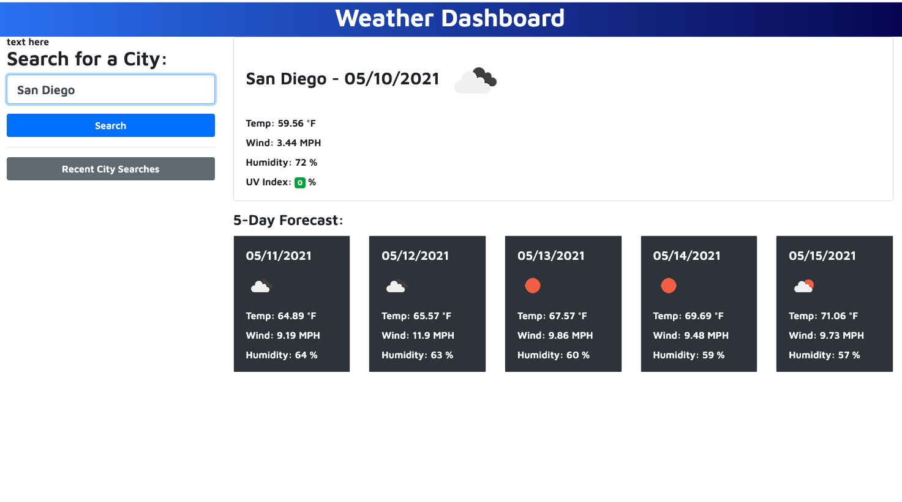

# 06 Server Side APIs
Assignment, Week 6; MSU Coding BootCamp

## Creating a Weather Dashboard

​

This is the sixth assigment for MSU Coding Bootcamp; to use third-party APIs to display weather data on my own weather dashboard page. This dashboard runs in the browser and features dynamically updated HTML and CSS that includes the data retreived from the APIs.

### Livepage Link
[Daniel Shoup's Weather Dashboard Page](https://danshoup.github.io/weather_dashboard/)

### Weather Dashboard Screenshot

### Acceptance Criteria Summary

- When searching for a city in a form input, current and future conditions for that city  are displayed on the page, and the city is added to the search history.

- City name, the date, an icon of the weather condition, temperature, humidity, wind speed, and UV index are displayed.

- View the UV index presents a color that represents the conditions being favorable, moderate, or severe.

- Viewing future conditions for chosen city presents a five-day forecast with the datae, icon representing conditions, temperature, wind speed, and humidity.

- When clicking on a city in the search history, current and future conditions for that city are displayed.

### Other Criteria

- Uses the OpenWeather API to retrieve weather data.

- Uses 'localStorage' to store persistent data.

- Weather Dashboard is deployed at live URL.

- Page loads with no errors.

- GitHub URL submitted.

- GitHub repository contains appropriate code.

- User experience is intuitive and easy to navigate.

- User interface is clean and polished.

- Applicateion resembles the mock-up and above criteria functionality.

- Repository has a unique name, and follows best practices for file structure and naming conventions.

- Quality README.md file with a description, screenshot, and link to deployed app.

- Repository includes manifold descriptive commit messages.

​

#### Dan's Notes:

Fetching data from third-party APIs expands what kind of information can be included in our applications moving forward.  